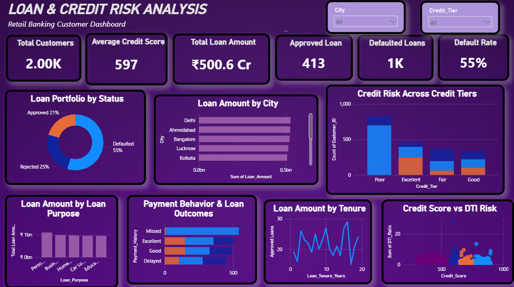

# 🏦 Retail Bank Customer Loan & Credit Risk Analysis

## 📌 Project Overview

The **Retail Bank Customer Loan & Credit Risk Analysis** project focuses on analyzing customer loan data to understand loan approval patterns, customer credit risk, repayment behavior, default rates, and loan performance.

The project uses **SQL for data analysis**, **Excel for data exploration and reporting**, and **Power BI for interactive visualization and dashboard development**.

---

## 🎯 Business Problem

A retail bank manages a large number of customer loans across different loan purposes, income levels, credit scores, employment types, and payment histories.

However, raw loan data does not immediately show **which customers or loan segments carry higher credit risk**.

The bank needs to understand:

- Loan approval and default patterns
- Customer credit risk
- Default rates across different loan purposes
- Relationship between credit score and loan performance
- Impact of payment history on defaults
- Loan exposure across different customer segments
- Key factors that can help improve lending decisions

### Problem Statement

> **Analyze customer loan and credit data to identify default patterns, high-risk customer segments, loan performance trends, and factors influencing credit risk, and present the findings through SQL analysis, Excel reporting, and an interactive Power BI dashboard.**

---

## 🎯 Project Objectives

- Analyze overall loan performance and customer risk.
- Identify loan segments with higher default rates.
- Compare default rates across different loan purposes.
- Analyze customer payment history and its relationship with defaults.
- Evaluate credit scores and credit tiers to understand customer risk.
- Analyze loan exposure across different customer segments.
- Identify patterns that can support better lending decisions.
- Present key findings through an interactive Power BI dashboard.

---

## 🛠️ Tools & Technologies

### SQL

- MySQL
- SELECT, WHERE, GROUP BY, HAVING
- Aggregate Functions
- CASE WHEN
- JOINs
- Subqueries
- CTEs
- Window Functions
- Date and conditional analysis

### Excel

- Data Cleaning
- Pivot Tables
- Aggregations
- Data Analysis
- Charts and Reporting

### Business Intelligence

- Power BI
- DAX
- KPI Cards
- Interactive Filters
- Data Visualization
- Dashboard Reporting

---

## 📊 Dataset

The dataset contains customer-level loan and credit information.

### Major Data Fields

- **Customer:** Customer ID, Age, Gender, City
- **Employment:** Employment Type, Annual Income
- **Loan:** Loan Amount, Loan Purpose, Loan Tenure
- **Credit:** Credit Score, Credit Tier
- **Payment:** Payment History
- **Risk:** DTI Ratio, LTI Ratio
- **Loan Performance:** Loan Status
- **EMI:** EMI Amount

---

## 🔄 Project Approach

The project followed a structured data analysis process:

**Raw Data → Data Preparation → SQL Analysis → Excel Analysis → KPI Development → Power BI Dashboard → Insights → Recommendations**

### SQL Analysis

SQL was used to analyze the loan dataset and answer important business questions such as:

- What is the overall default rate?
- Which loan purpose has the highest default rate?
- How does payment history affect default risk?
- Which credit tiers have higher default rates?
- How does loan amount vary across customer segments?
- Which customer groups represent higher loan exposure?

Complex SQL concepts such as **CTEs, CASE statements, aggregations, subqueries, and window functions** were used where required to perform the analysis.

### Excel Analysis

Excel was used to further analyze and summarize the loan data using:

- Pivot Tables
- Aggregations
- Conditional analysis
- Loan and default summaries
- Supporting charts and reports

---

## 📊 Power BI Dashboard

The final analysis was presented through an interactive **Power BI Credit Risk Dashboard**.

The dashboard provides a consolidated view of:

- Total Loan Amount
- Total Customers
- Default Rate
- Loan Performance
- Default Rate by Loan Purpose
- Default Rate by Payment History
- Credit Tier Analysis
- Customer and Loan Segmentation

### Dashboard Preview

---

## 📈 Key KPIs

| KPI | Result |
|---|---:|
| Total Loan Exposure | **₹5B+** |
| Overall Default Rate | **55%** |
| Highest Default Rate – Education Loans | **57.29%** |
| Default Rate – Missed Payment History | **96.75%** |
| Default Rate – Poor Payment History | **84.22%** |

---

## 🔍 Key Insights

### 💰 Loan Exposure

- The analysis covered more than **₹5B in total loan exposure**.
- Loan exposure was analyzed across different customer and loan segments to understand where the bank has greater financial risk.

### 📚 Loan Purpose

- **Education Loans recorded the highest default rate at 57.29%** among the analyzed loan purposes.
- This indicates that specific loan-purpose segments may require closer risk monitoring.

### 💳 Payment History

- Customers with **Missed payment history had a 96.75% default rate**.
- Customers with **Poor payment history had an 84.22% default rate**.
- Payment behavior therefore provides an important indicator for identifying high-risk customers.

### 📊 Credit Risk

- Customer credit scores and credit tiers were analyzed to understand differences in loan performance and default risk.
- Segmenting customers by credit characteristics can help the bank make more informed lending decisions.

---

## 🚧 Challenges Faced & Solutions

### Challenge 1 — Identifying High-Risk Customer Segments

The dataset contained multiple customer, loan, credit, and payment-related attributes, making it difficult to identify the segments contributing most to default risk.

**Solution:**  
I used SQL aggregations, conditional analysis, and segmentation to compare default rates across loan purposes, payment histories, and credit tiers.

### Challenge 2 — Comparing Multiple Loan Segments

Different loan purposes and customer groups had different levels of loan exposure and default rates.

**Solution:**  
I created grouped SQL analysis and Excel Pivot Tables to compare loan performance across different segments.

### Challenge 3 — Presenting Risk Analysis Clearly

The analysis contained multiple risk-related metrics that could be difficult to interpret from raw tables.

**Solution:**  
I converted the important findings into KPIs and interactive Power BI visuals so that business users could quickly identify high-risk segments.

---

## 💡 Business Recommendations

Based on the analysis:

- Closely monitor customers with **Missed or Poor payment histories**.
- Apply additional risk assessment to high-default loan-purpose segments.
- Use credit scores and credit tiers as important inputs during loan evaluation.
- Monitor high loan-exposure customer segments regularly.
- Develop targeted risk mitigation strategies for customers showing early signs of repayment problems.
- Use dashboard KPIs to continuously monitor loan performance and default trends.

---

## 🧠 Key Learning

This project helped me understand how SQL and Excel can be used to transform raw banking data into meaningful business insights.

Through this project, I gained practical experience in:

- Writing SQL queries for business analysis.
- Using aggregations, CTEs, subqueries, and window functions.
- Analyzing credit risk and loan performance.
- Using Excel Pivot Tables for data analysis.
- Creating meaningful KPIs.
- Building an interactive Power BI dashboard.
- Translating analytical findings into business recommendations.

---

## 🚀 Future Improvements

The project can be further improved by:

- Adding historical loan performance tracking.
- Developing a more detailed customer risk scoring model.
- Adding loan approval trend analysis.
- Monitoring early indicators of potential defaults.
- Adding automated data refresh and reporting.
- Building more detailed customer-level risk segmentation.
